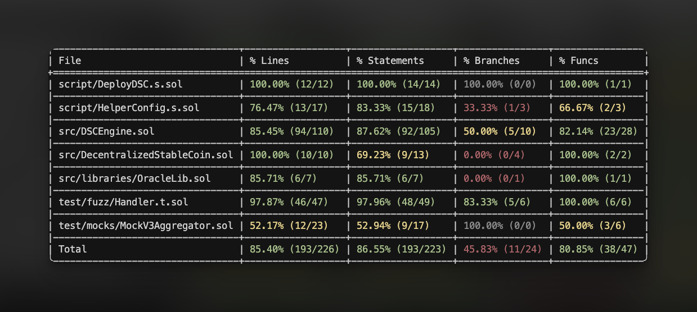

# Stablecoin

This is an exogenous stablecoin.

The exogenous assets are wETH and wBTC.

Chainlink is used to get the price of the exogenous assets.

## Test Coverage

I have added multiple unit and fuzz tests to cover the functionality of the contract.

